# Controle de acesso por Reconhecimento Facial

Esse projeto foi desenvolvido tendo como base a biblioteca esp-dl (https://github.com/espressif/esp-dl) e 
utilizou os métodos: *face_detect e recognize_face*.

- IDE utilizada: **PlatformIO**;

- Placa utilizada: **ESP32-CAM**;

Ao iniciar o projeto algumas configurações foram feitas no platformio.ini

```
[env:esp32cam]
platform = espressif32@2
board = esp32cam
framework = arduino
```

Tiveram que ser instaladas três bibliotecas: TFT_eSPI, TFT_eFEX e JPEGDecoder.

```
lib_deps = 
	bodmer/TFT_eSPI@^2.2.6
	bodmer/TFT_eFEX@^0.0.8
	bodmer/JPEGDecoder@^1.8.1
```

A biblioteca TFT_eSPI precisa ser configurada para funcionar com o Display TFT ST7735S. 
Copie o conteúdo do arquivo **extra/User_Setup.h**, para o arquivo da biblioteca recém-instalada *User_Setup.h* encontrado em: 
**.pio/libdeps/esp32cam/TFT_eSPI/User_Setup.h**

Para desabilitar todos os warnings ou alertas da biblioteca, adicione em *User_Setup_Select.h* a seguinte linha:

```
#define DISABLE_ALL_LIBRARY_WARNINGS
```

Outro detalhe é que para rodar o projeto também é preciso que as imagens que estão na pasta **data** sejam carregadas na memória flash (filesystem/spiffs). 
Para isso é preciso configurar a partição:

```
board_build.partitions = no_ota.csv
board_build.filesystem = spiffs
```

E também seguir as instruções abaixo: 

https://randomnerdtutorials.com/esp32-vs-code-platformio-spiffs/

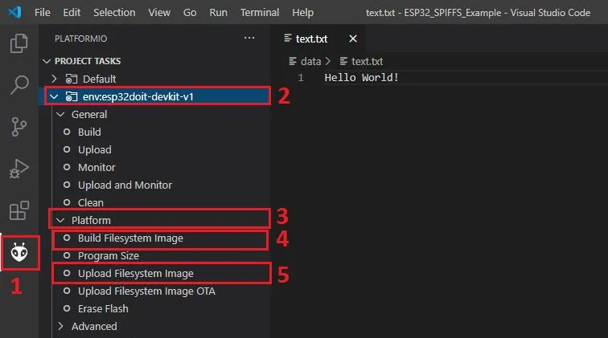

Obs: Caso altere o esquema de partição no IDE, esses dados serão sobrescritos

## Estrutura do projeto 📁

```sh

- include/ # Arquivos de cabeçalhos, onde é definido as interfaces dos métodos de cada arquivo
  |- camera.h
  |- constants.h
  |- debug.h
  |- display.h
  |- face_detect.h
  |- face_recognition.h
  |- sd_card.h
  |- timer.h
  |- user.h
- src/ # Implementações
  |- camera/ 
  |  |- camera.cpp # Métodos da câmera
  |- debug/
  |  |- debug.cpp # Métodos de debug no código. ENABLE_PRINT_DEBUG habilita e desabilita os prints no monitor serial
  |- display/
  |  |- display.cpp # Métodos para desenhar no display LCD (display_init, display_write_string, display_menu ...)
  |- face_detect/
  |  |- face_detect.cpp # Métodos para identificar rostos
  |- face_recognition/
  |  |- face_recognition.cpp # Métodos para reconhecimento facial (ler e cadastrar usuários)
  |- sd_card/
  |  |- sd_card.cpp # Métodos para leitura e gravação de arquivos no sd card
  |- timer/
  |  |- timer.cpp # Métodos do temporizador (init_timer, stop_timer)
  |- user/
  |  |- user.cpp # Métodos para gerenciar usuarios (save_user, load_user, delete_user, enter_password)
- main.cpp # Código principal
```

## Arquivos .h

Um arquivo de cabeçalho é um arquivo que contém declarações/interfaces em C++, junto das definições/contratos
para ser compartilhado entre vários arquivos de origem do projeto. Você solicita o uso de um
arquivo de cabeçalho no arquivo fonte do seu projeto (C, C++, etc) localizado na pasta `src`
incluindo-o, com a diretiva de pré-processamento C `#include'.

```src/debug/debug.cpp

#include "debug.h"

void print(int value)
{
  ...
}
```

Incluir um arquivo de cabeçalho produz os mesmos resultados que copiar o arquivo de cabeçalho
em cada arquivo de origem que precisa dele. Essa cópia seria demorada
e sujeito a erros. Com um arquivo de cabeçalho, as declarações relacionadas aparecem
em apenas um lugar. Se eles precisarem ser alterados, eles podem ser alterados em um
local, e os programas que incluem o arquivo de cabeçalho usarão automaticamente o
nova versão na próxima recompilação. O arquivo de cabeçalho elimina o trabalho de
encontrar e alterar todas as cópias, bem como o risco de que uma falha em
encontrar uma cópia resultará em inconsistências dentro de um programa.

Em C, a convenção usual é dar nomes aos arquivos de cabeçalho que terminem com `.h'.


## FUNCIONAMENTO DO PROJETO

- Fluxo de funcionamento

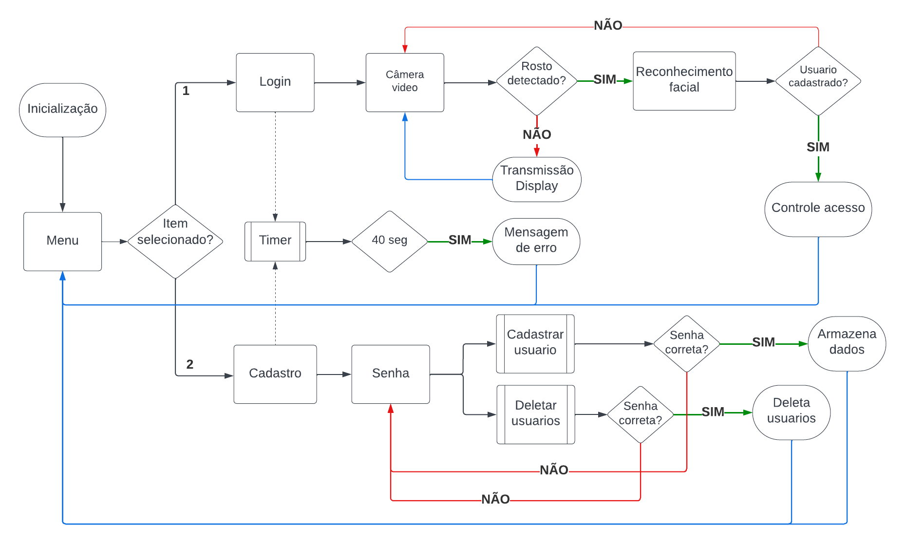

- Telas de inicialização

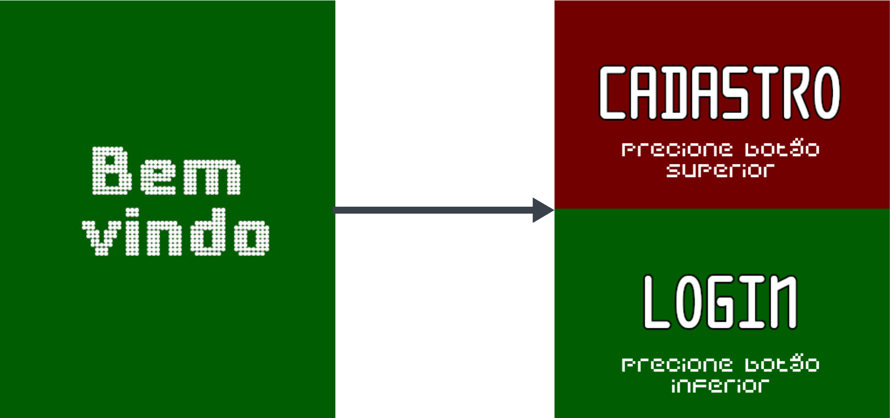

- Autenticação do usuário

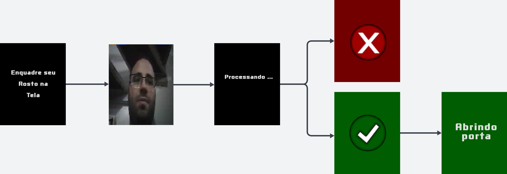

- Cadastro de usuário

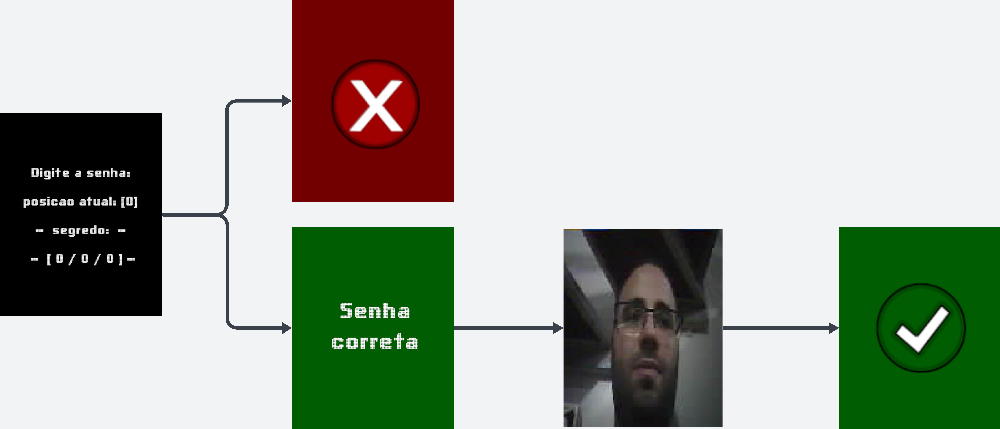

- Deletar usuário

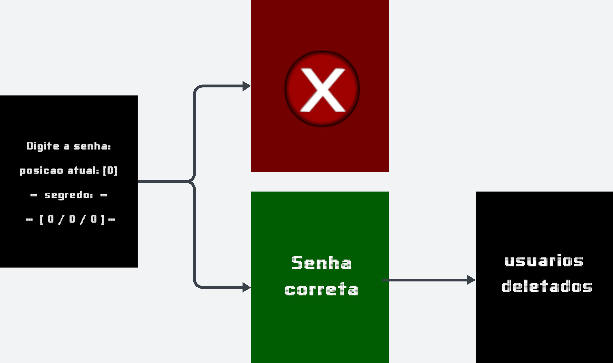

- Diagrama elétrico ESP32-CAM

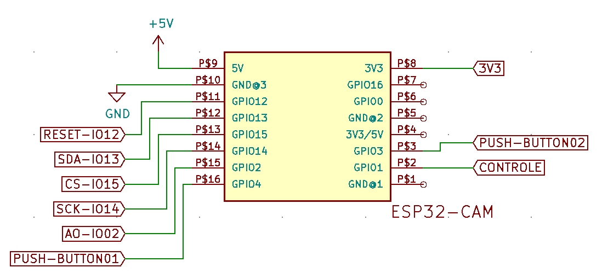

- Diagrama elétrico Display LCD TFT ST7734

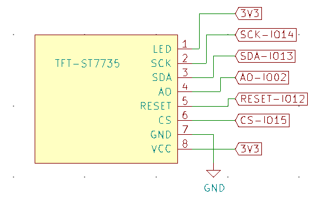

- Diagrama elétrico módulo relé

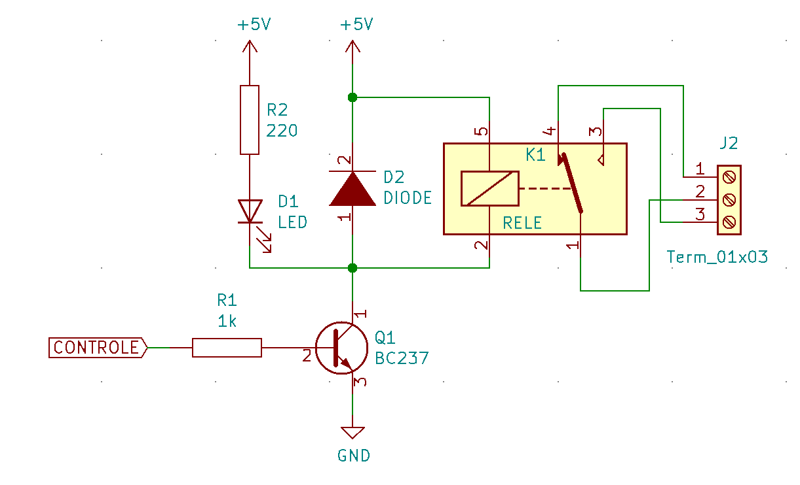

- Diagrama elétrico dos botões

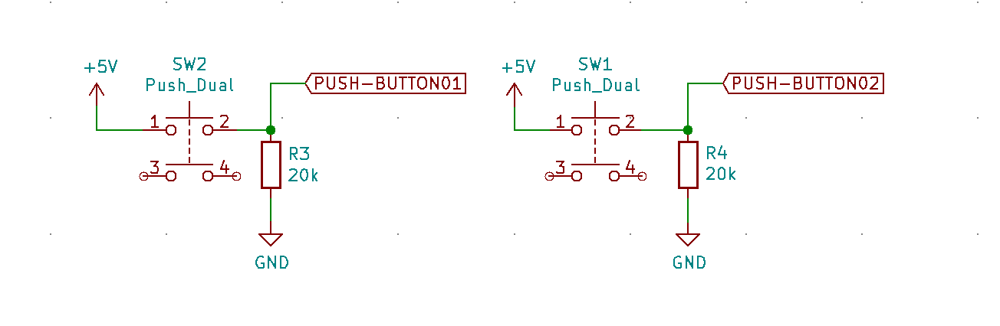

- Placa montada

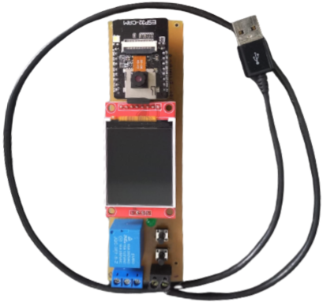

- Placa finalizada

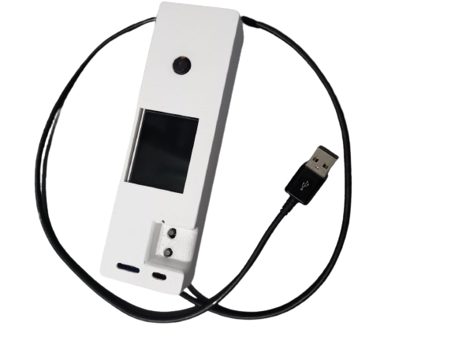

- Exemplo do seu funcionamento


## TRABALHO RELACIONADO

https://github.com/JoseBarreto1/tcc

## PINOS ESP32

Você descobrirá que a maioria dos pinos da câmera ESP32 já estão em uso ou apresentam comportamentos instáveis.
Para tornar as coisas um pouco mais confusas, o layout parece ter sido feito por um engenheiro embriagado ou (mais provavelmente) por um roteador automático de rastreamento.
Algumas dessas decisões erradas (por exemplo, não expor os pinos I2C) prejudicam significativamente as possíveis aplicações.
No entanto, os pinos listados como “não expostos” podem ser acessíveis usando um ferro de solda ou um FPC personalizado na interface da câmera.

## Índice

- [Afixar notas](#pin-notas)
   - [Índice](#índice)
   - [GPIO0 - CAM_PIN_XCLK ou CSI_MCLK](#gpio0---cam_pin_xclk-ou-csi_mclk)
   - [GPIO1 - U0TXD](#gpio1---u0txd)
   - [GPIO2 - HS2_DATA0 (IO2) MISO](#gpio2---hs2_data0-io2-miso)
   - [GPIO3 - U0RXD](#gpio3---u0rxd)
   - [GPIO4 - HS_DATA1](#gpio4---hs_data1)
   - [GPIO5 - (não exposto)](#gpio5---não-exposto)
   - [GPIO6 - (não exposto)](#gpio6---não-exposto)
   - [GPIO7 - (não exposto)](#gpio7---não-exposto)
   - [GPIO8 - (não exposto)](#gpio8---não-exposto)
   - [GPIO9 - (não exposto)](#gpio9---não-exposto)
   - [GPIO10 - (não exposto)](#gpio10---não-exposto)
   - [GPIO11 - (não exposto)](#gpio11---não-exposto)
   - [GPIO12 - HS2_DATA2](#gpio12---hs2_data2)
   - [GPIO13 - HS2_DATA3](#gpio13---hs2_data3)
   - [GPIO14 - HS2_CLK SCK](#gpio14---hs2_clk-sck)
   - [GPIO15 - HS2_CMD](#gpio15---hs2_cmd)
   - [GPIO16 - U2RXD "gpio inútil"](#gpio16---u2rxd-useless-gpio)
   - [GPIO17 - (não exposto) PSRAM_CLK](#gpio17---not-exposed-psram_clk)
   - [GPIO18 - (não exposto)](#gpio18---não-exposto)
   - [GPIO19 - (não exposto)](#gpio19---não-exposto)
   - [GPIO20 - ??](#gpio20---)
   - [GPIO21 - (não exposto)](#gpio21---não-exposto)
   - [GPIO22 - (não exposto)](#gpio22---não-exposto)
   - [GPIO23 - (não exposto)](#gpio23---não-exposto)
   - [GPIO24 - (não exposto) - ??](#gpio24---não-exposto---)
   - [GPIO25 - (não exposto)](#gpio25---não-exposto)
   - [GPIO26 - (não exposto)](#gpio26---não-exposto)
   - [GPIO27 - (não exposto)](#gpio27---não-exposto)
   - [GPIO28 - (não exposto)](#gpio28---não-exposto)
   - [GPIO29 - (não exposto)](#gpio29---não-exposto)
   - [GPIO30 - (não exposto)](#gpio30---não-exposto)
   - [GPIO31 - (não exposto)](#gpio31---não-exposto)
   - [GPIO32 - (não exposto)](#gpio32---não-exposto)
   - [GPIO33 - (tipo de LED de PCB exposto)](#gpio33---led-pcb-meio-exposto)
   - [GPIO34 - (não exposto)](#gpio34---não-exposto)
   - [GPIO35 - (não exposto)](#gpio35---não-exposto)
   - [GPIO36 - (não exposto)](#gpio36---não-exposto)
   - [GPIO37 - (não exposto)](#gpio37---não-exposto)
   - [GPIO38 - (não exposto)](#gpio38---não-exposto)
   - [GPIO39 - (não exposto)](#gpio39---não-exposto)

## GPIO0 - CAM_PIN_XCLK ou CSI_MCLK
* Puxe para o chão (na reinicialização) para colocar a placa no modo flash
* Internamente possui um resistor pullup de 3,3 V 10k (R19)
* CSI_MCLK é usado pela Camera (linha 12 no FPC)
* pino de amarração - [folha de dados ESP32_S](https://www.espressif.com/sites/default/files/documentation/esp32_datasheet_en.pdf), padrão: pull-up spi-boot:1, download-boot:0
* Suporta Capactive Sensing T1 (consulte a seção 4.1.5 da folha de dados ESP32_S "Sensor de toque")
* ADC2_CH1 - ADC SAR de 12 bits
* Sinal: HSPIHD - QSPI Paralelo
* Sinal: EMAC_TX_CLK - Interface Ethernet MAC MII/RII
* listado na folha de dados ESP32_S como "RTC_Function2" I2C_SDA
* designado como (wpu) "fraco pull up" pela folha de dados ESP32_S v3.4 pg53 IO/Mux Addendum

## GPIO1 - U0TXD
*usado para saída serial
* designado como SOMENTE SAÍDA

## GPIO2 - HS2_DATA0 (IO2) MISO
* Usado por cartão SD
* Utilizável como SPI MISO ([referência](https://github.com/raphaelbs/esp32-cam-ai-thinker/issues/55))
* pino de amarração - [folha de dados ESP32_S](https://www.espressif.com/sites/default/files/documentation/esp32_datasheet_en.pdf), padrão: pull-down - deve estar desativado para baixar a inicialização no GPIO0)
* Suporta Capactive Sensing T2 (consulte a seção 4.1.5 da folha de dados ESP32_S "Sensor de toque")
* ADC2_CH2- SAR ADC de 12 bits, cartão de memória SD v3.01
* Sinal: HSPIWP - QSPI Paralelo
* designado como (wpd) "fraco pull down" pela folha de dados ESP32_S v3.4 pg53 IO/Mux Addendum

## GPIO3 - U0RXD
*usado para entrada serial
* Sinal: EMAC_RXD2 - Interface Ethernet MAC MII/RII
* designado como I1? (somente entrada?)

## GPIO4 - HS_DATA1
* Usado por cartão SD
* possui um resistor de 47Kohm (R11) na linha SD1/MicroSD
* conectado ao LED SMD 3030 integrado (lanterna)
* pode ser utilizável como SPI MOSI (é necessário verificar)
* Suporta Capactive Sensing T0 (consulte a seção 4.1.5 da folha de dados ESP32_S "Sensor de toque")
* ADC2_CH0- SAR ADC de 12 bits, suporta cartão de memória SD v3.01
* Sinal: EMAC_TX_ER - Interface Ethernet MAC MII/RII
* listado na folha de dados ESP32_S como "RTC_Function2" I2C_SCL
* designado como (wpd) "fraco pull down" pela folha de dados ESP32_S v3.4 pg53 IO/Mux Addendum
* 'Hack' do cartão SD de 1 bit inicializa o cartão microSD da seguinte maneira, então o cartão microSD não usará as linhas de dados GPIO4, GPIO12, GPIO13 (HS_DATA1, HS_DATA2, HS_DATA3 respectivamente)!
   ```
   // habilita SD_MMC no menuconfig > seção Arduino
   #include "SD_MMC.h"
   ...
   SD_MMC.begin("/sdcard", verdadeiro)
   ```
   https://randomnerdtutorials.com/esp32-cam-ai-thinker-pinout/

## GPIO5 - (não exposto)
* CSI_D0 esp_camera.h:CAM_PIN_D0 -> Câmera FPC Y2
* pino de amarração - [folha de dados ESP32_S](https://www.espressif.com/sites/default/files/documentation/esp32_datasheet_en.pdf), padrão: pull-up com controles GPIO5 Timing do escravo SDIO (ver documentação)
* Sinal: VSPICS0 - QSPI paralelo
* Sinal: EMAC_RX_CLK - Interface Ethernet MAC MII/RII

## GPIO6 - (não exposto)
* SD_CLK, HS1_CLK
* SPICLK - QSPI paralelo

## GPIO7 - (não exposto)
* SD_DATA0, HS1_DATA0

## GPIO8 - (não exposto)
* SD_DATA1, HS1_DATA1

## GPIO9 - (não exposto)
* SD_DATA2, HS1_DATA2
* SPIHD - QSPI paralelo

## GPIO10 - (não exposto)
* SD_DATA3, HS1_DATA3
* SPIWP - QSPI paralelo

## GPIO11 - (não exposto)
* SD_CMD, HS1_CMD
* SPICS0 - QSPI paralelo

## GPIO12 - HS2_DATA2
* Referência da folha de dados ESP32_S: MTDI
* Dica: use o truque do modo SD-Card 1bit descrito no GPIO4 para usar este pino!
* usado como pino de cintagem - [ficha técnica ESP32_S](https://www.espressif.com/sites/default/files/documentation/esp32_datasheet_en.pdf), padrão: pull-down seleciona tensão (3,3v:0, 1,8v: 1)
* Suporta Capactive Sensing T5 (consulte a seção 4.1.5 da folha de dados ESP32_S "Sensor de toque")
* JTAG, ADC2_CH5 - ADC SAR de 12 bits
* Sinal HSPIQ - QSPI Paralelo
* Sinal: EMAC_TXD3 - Interface Ethernet MAC MII/RII
* também RTC_GPIO15
* MTDI (GPIO12) é usado como pino de inicialização para selecionar a tensão de saída de um regulador interno (VDD_SDIO) que alimenta o chip flash.
* quando conectado como SDA (para I2C) causa exceção "RTCWDT_RTC_REST" ets_main.c 371 na inicialização devido à tensão do flash não estar definida corretamente.
* Para resolver: é (Recomendado) pela EspressIf Queimar os eFuses de seleção de tensão do flash. Isso configurará permanentemente a tensão de saída do regulador interno para 3,3 V e o GPIO12 não será usado como pino de inicialização. Depois disso, conecte um resistor pull-up ao GPIO12.
* Referência e instruções: [visão geral da compatibilidade](https://docs.espressif.com/projects/esp-idf/en/latest/esp32/api-reference/peripherals/sd_pullup_requirements.html#compatibility-overview-espressif-hw -sdio)

## GPIO13 - HS2_DATA3
* Folha de dados ESP32_S: MTCK
* Dica: use o truque do modo SD-Card 1bit descrito no GPIO4 para usar este pino!
* Suporta Capactive Sensing T4 (consulte a seção 4.1.5 da folha de dados ESP32_S "Sensor de toque")
* JTAG, ADC2_CH4- SAR ADC de 12 bits, cartão de memória SD v3.01
* Sinal HSPID - QSPI Paralelo
* Sinal: EMAC_RX_ER - Interface Ethernet MAC MII/RII

## GPIO14 - HS2_CLK SCK
* Folha de dados ESP32_S: MTMS
* Utilizável como SPI CLK ([referência](https://github.com/raphaelbs/esp32-cam-ai-thinker/issues/55))
* Suporta Capactive Sensing T6 (consulte a seção 4.1.5 da folha de dados ESP32_S "Sensor de toque")
* JTAG, ADC6_CH0- SAR ADC de 12 bits, cartão de memória SD v3.01
* Sinal: HSPICLK - QSPI Paralelo
* Sinal: EMAC_TXD2 - Interface Ethernet MAC MII/RII
* também RTC_GPIO16

## GPIO15 - HS2_CMD
* Folha de dados ESP32_S: MTDO
* pode ser utilizável como um SPI CS/CMD (é necessário verificar)
* pino de cinta - [folha de dados ESP32_S](https://www.espressif.com/sites/default/files/documentation/esp32_datasheet_en.pdf), padrão: pull-up ativar/desativar impressão de log de depuração em U0TXD durante a inicialização (ativo: 1, silencioso:0)
* Suporta Capactive Sensing T3 (consulte a seção 4.1.5 da folha de dados ESP32_S "Sensor de toque")
* JTAG, ADC2_CH3- SAR ADC de 12 bits
* Sinal HSPICS0 - QSPI Paralelo
* Sinal: EMAC_RXD3 - Interface Ethernet MAC MII/RII
* designado como (wpu) "fraco pull up" pela folha de dados ESP32_S v3.4 pg53 IO/Mux Addendum

## GPIO16 - U2RXD "gpio inútil"
* não é RTC (não pode ser usado para medição de precisão ou pwm)
* Observe que GPIO 16 não é um pino ADC, portanto você não pode ler sensores analógicos neste pino.
* Além disso, o GPIO 16 não é um RTC GPIO, portanto não pode ser usado como fonte de ativação externa.
* possui um resistor pull-up de 10Kohm
* está conectado ao pino 1 CS# do PSRAM64 integrado (SRAM CMOS de 64 Mbit/8 MB) que é necessário para a *maioria* das aplicações de câmera de alta resolução
* Sinal: EMAC_CLK_OUT - Interface Ethernet MAC MII/RII

## GPIO17 - (não exposto) PSRAM_CLK
* Sinal: EMAC_CLK_OUT_180 - Interface Ethernet MAC MII/RII

## GPIO18 - (não exposto)
* CSI_D1 esp_camera.h:CAM_PIN_D1 -> Câmera FPC Y3
* Sinal VSPICLK - QSPI paralelo

## GPIO19 - (não exposto)
* CSI_D2 esp_camera.h:CAM_PIN_D2 -> Câmera FPC Y4
* Sinal VSPIQ - QSPI Paralelo
* Sinal: EMAC_TXD0 - Interface Ethernet MAC MII/RII

## GPIO20 - ??

## GPIO21 - (não exposto)
* esp_camera.h:CAM_PIN_D3 -> Câmera FPC Y5
* Sinal VSIHD - QSPI paralelo
* Sinal: EMAC_TX_EN - Interface Ethernet MAC MII/RII

## GPIO22 - (não exposto)
* CS1_PCLK esp_camera.h:CAM_PIN_PCLK
* Sinal VSPIWP - QSPI paralelo
* Sinal: EMAC_TXD1 - Interface Ethernet MAC MII/RII

## GPIO23 - (não exposto)
* CS1_HSYNC esp_camera.h:CAM_PIN_HREF
* Sinal VSPID - QSPI paralelo

## GPIO24 - (não exposto) - ??

## GPIO25 - (não exposto)
* esp_camera.h:CAM_PIN_VSYNC -> Câmera FPC CS1_VSYNC
* DAC_1, ADC2_CH8 - ADC SAR de 12 bits
* Sinal: EMAC_RXD0 - Interface Ethernet MAC MII/RII
* também RTC_GPIO6

## GPIO26 - (não exposto)
* TW1_SDA esp_camera.h:CAM_PIN_SIOD -> Câmera FPC SIO_D TW1_SCK (linha 20)
* poderia ser usado para I2C SDA (se estivesse exposto)
* tem resistor de 4,7k (R17), talvez adaptável com um fio (mas não tenho certeza da localização)
* DAC_2, ADC2_CH9 - ADC SAR de 12 bits
* Sinal: EMAC_RXD1 - Interface Ethernet MAC MII/RII
* também RTC_GPIO7

## GPIO27 - (não exposto)
* TW1_SCK esp_camera.h:CAM_PIN_SIOC -> Câmera FPC SIO_C TW1_SCK (linha 22)
* poderia ser usado para I2C SCL (se estivesse exposto)
* possui resistor de 4,7k (R18), talvez adaptável com um fio (mas não tenho certeza da localização)
* Suporta Capactive Sensing T7 (consulte a seção 4.1.5 da folha de dados ESP32_S "Sensor de toque")
* ADC2_CH7 - ADC SAR de 12 bits
* Sinal: EMAC_RX_DV - Interface Ethernet MAC MII/RII
* também RTC_GPIO17

## GPIO28 - (não exposto)
* ?? não definido nas especificações ESP32_S

## GPIO29 - (não exposto)
* ?? não definido nas especificações ESP32_S

## GPIO30 - (não exposto)
* ?? não definido nas especificações ESP32_S

## GPIO31 - (não exposto)
* ?? não definido nas especificações ESP32_S

## GPIO32 - (não exposto)
* esp_camera.h:CAM_PIN_PWDN - Redefinir chave "K1"
* Nome do pino analógico: 32K_XP
* A linha esp32cam pcb possui 0,1uF acoplado ao GND
* A linha esp32cam pcb tem pullup de 3,3v 10Kohm (R6)
* ADC1_CH4
* Suporta Capactive Sensing T9 (consulte a seção 4.1.5 da folha de dados ESP32_S "Sensor de toque")
* também RTC_GPIO9

## GPIO33 - LED PCB (meio exposto)
* Nome do pino analógico: 32K_XN
* Suporta Capactive Sensing T8 (consulte a seção 4.1.5 da folha de dados ESP32_S "Sensor de toque")
* Está conectado ao LED interno AZUL (autêntico)/VERMELHO (clone) no PCB.
* Se estiver ativado, o WIFI não funcionará.
* ADC1_CH5
* também RTC_GPIO8

## GPIO34 - (não exposto)
* esp_camera.h:CAM_PIN_D6 -> Câmera FPC Y8
* Nome do pino analógico: VDET_1
* ADC1_CH6
* também RTC_GPIO4

## GPIO35 - (não exposto)
* esp_camera.h:CAM_PIN_D7
* Pino analógico: VDET_2
* ADC1_CH7
* também RTC_GPIO5

## GPIO36 - (não exposto)
* esp_camera.h:CAM_PIN_D4
* Nome do pino analógico: SENSOR_VP
* ADC1_CH0
* também RTC_GPIO0

## GPIO37 - (não exposto)
* Nome do pino analógico: SENSOR_CAPP
* ADC1_CH1
* também RTC_GPIO1

## GPIO38 - (não exposto)
* Nome do pino analógico: SENSOR_CAPN
* ADC1_CH2
* também RTC_GPIO2

## GPIO39 - (não exposto)
* esp_camera.h:CAM_PIN_D5 -> Câmera FPC Y9
* Nome do pino analógico: SENSOR_VN
* ADC1_CH3
* também RTC_GPIO3


Esquema do ESP32-S

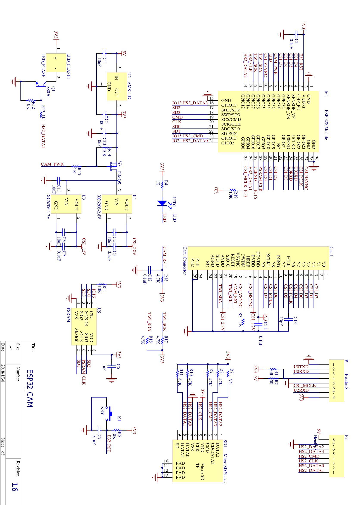

Refência:

https://microcontrollerslab.com/esp32-cam-ai-thinker-pinout-gpio-pins-features-how-to-program/
